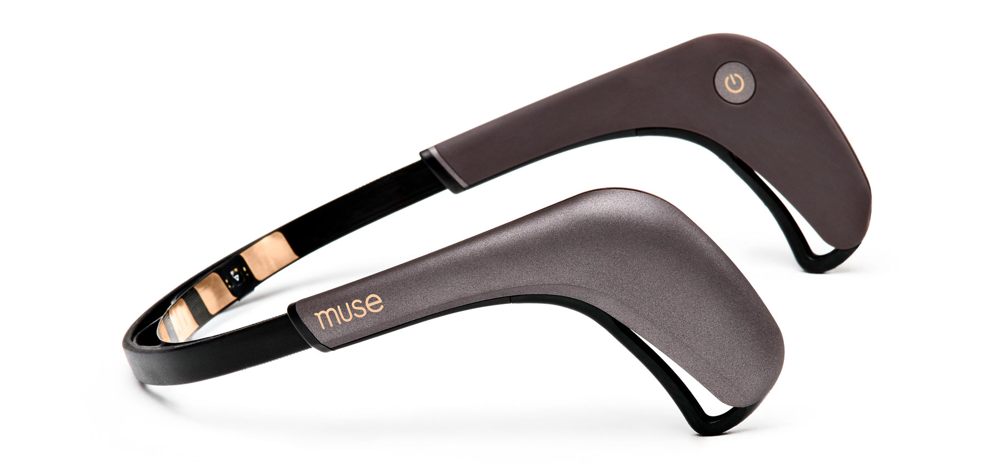
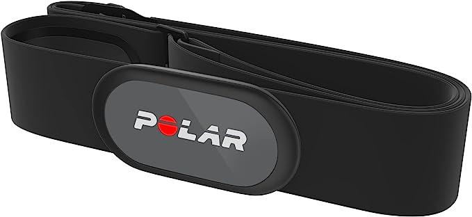

# ClosedLoop Biosignal Data Streaming and Analysis

This project provides an integrated solution for streaming and analyzing biometric data from the Polar H10 heart rate sensor and the Muse 2 EEG device. It offers real-time processing and analysis capabilities of both heart rate and EEG data for research and application in neuroscience, sports science, health monitoring, and other related fields. 

<p float="left">
  
   
</p>


## Features
1. **Live Data Processing**: Capable of performing real-time data analysis, including filtering, calculating heart rate from ECG data, and breathing rate from accelerometer data. It can also integrate readings from multiple sources (e.g., PPG, ECG, and accelerometer) to improve the accuracy by mitigating movement artifacts.
2. **Expandable Device Support**: Architecture allows for straightforward addition of new input and stimulation devices to run concurrently.
3. **Device Mapping**: Provides flexibility to map input devices to stimulation devices, supporting various configurations (one-to-one, one-to-all, all-to-one, etc.)
4. **Dynamic Stimulation Parameters**: Parameters can be hardcoded or made to follow specific rules. They can depend on single or multiple input devices, consider past data, or be entirely independent.
5. **Stimulation Device Configuration**: Allows individual parameter settings for each stimulation device.
6. **Stimulation Timing**: Supports independent or overlapping durations and idle times for stimulation events.
7. **Data Export**: Records data from sensors as CSV files, complete with timestamps and sensor identifiers.
8. **Stimulation Period Export**: Records periods of stimulation by each device, if any are in use.
9. **Live Plotting**: Option to visualize sensor data in real-time while recording. Can be toggled off for specific sensors to conserve memory.
10. **Optimized Resource Utilization**: Leverages asyncio library for I/O-bound tasks and multiprocessing library for CPU-bound tasks to make efficient use of computational resources.

## Prerequisites

* A Polar H10 heart rate sensor.
* A Muse 2 EEG device.
* Python 3.7 or above.
* Installation of necessary Python libraries as listed in `requirements.txt`.

## Installation

Clone the repository:

```sh
git clone https://github.com/rosiller/BiosignalClosedLoop
cd BiosignalClosedLoop
```

Install the required Python libraries:

```sh
pip install -r requirements.txt
```

## Usage

```sh
python main.py --duration DURATION
```

Replace `DURATION` with the duration for which you want to collect the data in seconds. 

## Data

The application saves the streamed data, processed signals, and analysis results as .csv files in the `1-Data` directory. 

## How it Works

The application uses the asyncio library for concurrent execution of data streaming, processing, and analysis tasks. The data from the devices is streamed using the bluepy library for Bluetooth communication. For signal processing and analysis, it leverages libraries such as NeuroKit and NumPy.

## Dependencies/Acknowledgements

This project was made possible thanks to the open-source community. Special thanks to the developers of muse-lsl, NeuroKit, bluepy, asyncio, NumPy, and all the other libraries used in this project.
